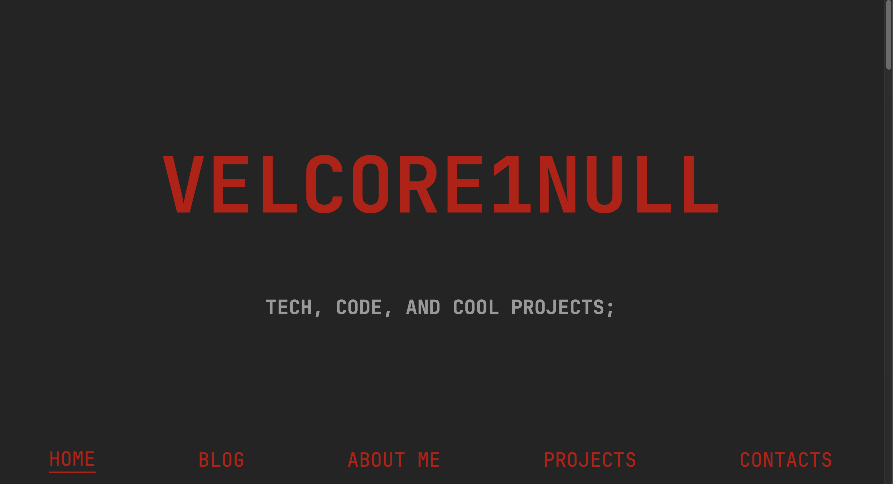
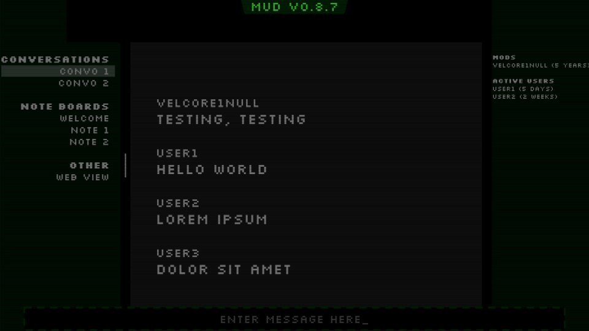

# velcore1null - A Puzzle Game

[velcore1null](https://velcore1null.netlify.app) is more of a puzzle than a game. Explore what user velcore1null blogged about and you might uncover something sinister going on behind the scenes...

<!-- TODO: Update this once its done or more done -->

Currently, the velcore1null project is just a blog site with no blogs. Despite that, if you are interested, you can [check it out here](https://velcore1null.netlify.app)! Some of the things listed in the description is not fully implemented, but planned to be soon. 

To play, just visit the website and start searching for clues. I won't say it will be easy, but figure it out and you'll be part of the puzzle forever!

### Technical Description

This project was made mainly with pure HTML and CSS. The backend is written in Python.

I've written code in Python and made static sites with HTML before, but I've never combined them to make a dynamic website. This project is an experiment to learn how to combine my skills into a project. 

I hold my code almost to professional standards. I follow conventions to make my code as readable as possible and as expandable as possible. I use techniques including but not limited to:

1. Commenting code
2. Using CSS custom variables
3. Adding inline documentation
4. Adding docstrings
5. Using relative and clamped values

That also means that my code is really easy to help contribute to! Help is always welcome. 

The game has two components, those being the blog page and the secret backdoor page. For both, I designed the page in google slides. This is similar to wireframing but, in my opinion, easier to create, and a better visualization. It allows me to pin down exactly how I want the page to look without having to edit code and debug CSS. 
After I design the page, I create the skeleton of it using just HTML, without any CSS. This is a new technique I've been trying for this project. I just look at my reference slides, decide what needs a container and how to modularize it, and just write. It's actually (maybe surprisingly) worked really well! It lets me just focus on getting it done without being sidetracked to change some settings in the styling. 
Finally, I style the page with CSS working from top to bottom, all in a new, empty .css file. I don't have much to say about this last step, it's basically just finishing up the fun stuff after everything else has been structured. It does definitely help not having to context-switch between the style and structure constantly. And that's it! As a static webpage, it's done!

<!-- TODO: Update if this changes!! -->
I do not use Artifical Intelligence to write my code. I recognize that it is a helpful tool, but I enjoy the process and would like to keep programming as a hobby. That being said, I am not opposed at all to having AI write tedious or unfun parts, even refactoring code if I don't think I'll enjoy it or gain experience from it. At the time of writing, no AI has been used to write code or text

### About the Game

I don't usually make games, so this is new for me. It's also a very unique type of game, taking the form of a real webpage. 
I won't spoil anything about the game or puzzles here, so you can [chip in to solving them](https://velcore1null.netlify.app)!

This game starts with internet blogger and tech enthusiast named velcore1null's personal webpage. He hosts a blog on it, which the game revolves around. After learning about this person for a bit by looking through the blog, you might start to notice that this is not a normal website. Some abnormalities come up, subtle at first, but seemimgly more and more often. 

After the player notices the pattern, they gain access to a secret backdoor in the blog website. They are given a rundown of everything that velcore knew about a specific web crawler dubbed "The Archive"—and what velcore didn't know. 

